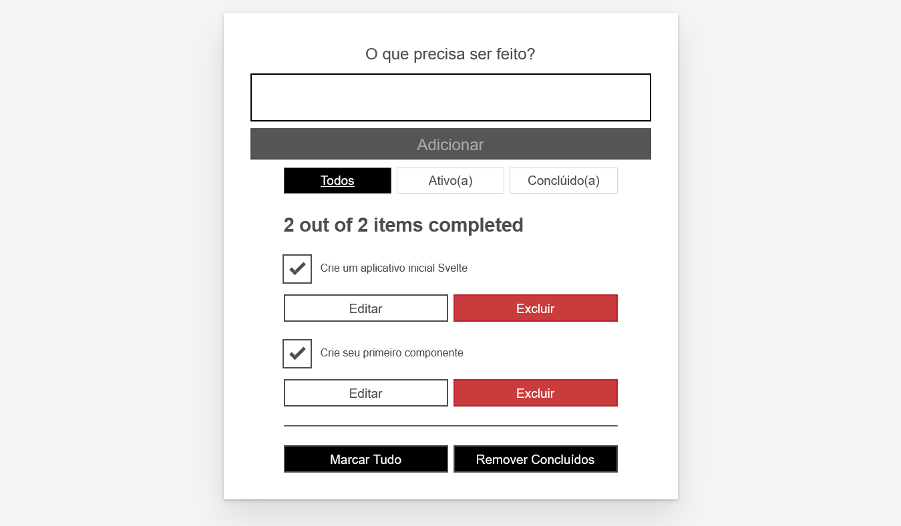

# App To-Do List

Aplicativo de lista de tarefas. Queremos que nossos usuários possam navegar, adicionar e excluir tarefas, e também marcá-las como concluídas.

Recursos do aplicativo web To-Do List

- [x] Navegue pelas tarefas deles
- [x] Marcar tarefas como concluídas/pendentes sem excluí-las
- [x] Remover tarefas
- [x] Adicionar novas tarefas
- [x] Filtre tarefas por status: todas as tarefas, tarefas ativas ou tarefas concluídas
- [x] Editar tarefas
- [x] Marcar todas as tarefas como ativas/concluídas
- [x] Remova todas as tarefas concluídas

## Captura de tela



## Stack

| Tecnologia | Descrição              |
| ---------- | ---------------------- |
| Svelte     | Framework frontend     |
| TypeScript | Linguagem              |
| Vite       | Build tool             |
| Prettier   | Formatter              |
| ESLint     | Linter                 |
| NPM        | Gerenciador de pacotes |

## Requisitos

Você precisará de um terminal com node + npm instalado para compilar e construir seu aplicativo.

1. Node
2. [NPM](https://www.npmjs.com/)

## Comandos

Instalar as dependências do projeto

```bash
npm install
```

Rodar a aplicação em modo desenvolvimento (Vite)

```bash
npm run dev
```

---

Executa a verificação do Svelte

```bash
npm run check
```

---

Verifica os `.ts` arquivos, que informa ao compilador TypeScript para verificar se há erros sem gerar os `.js` arquivos de saída

```bash
npm run check && npx tsc --noemit
```

---

Executa a verificação do Svelte no modo observação, neste caso, o script será executado sempre que você alterar algum arquivo.

```bash
npm run check -- --watch
```

---

Buildar a aplicação (Vite)

```bash
npm run build
```

---

Pré-visualizar o build (Vite)

```bash
npm run preview
```
